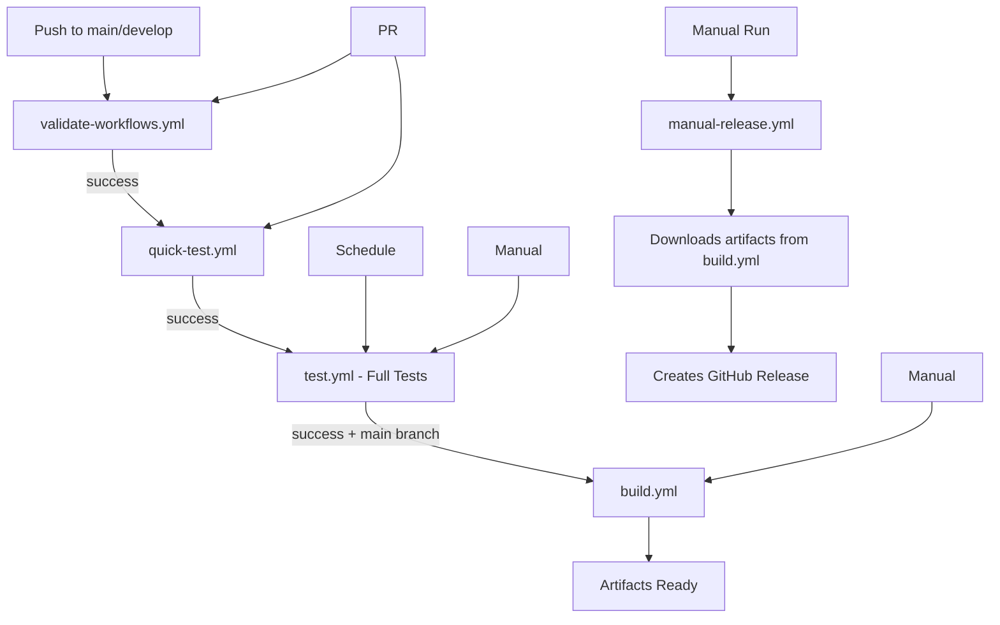

# GitHub Actions Workflows

This project uses the following workflows in a specific sequence:

## Automatic Workflows (on every push/PR)

### 1. `validate-workflows.yml` - Validation
- **Trigger**: Push/PR to main/develop
- **Purpose**: YAML syntax validation, required fields check
- **Execution time**: ~1-2 minutes

### 2. `quick-test.yml` - Quick Tests  
- **Trigger**: After `validate-workflows.yml` succeeds, or PR/manual
- **Purpose**: Fast functionality check (1 sec video/audio)
- **Execution time**: ~3-5 minutes

## Periodic/Manual Workflows

### 3. `test.yml` - Full Testing
- **Trigger**: After `quick-test.yml` succeeds, schedule (daily at 2:00 UTC), or manual run
- **Purpose**: Complete unit/integration/performance tests on all platforms
- **Execution time**: ~15-30 minutes

### 4. `build.yml` - Build Artifacts
- **Trigger**: After `test.yml` succeeds on main branch, or manual run
- **Purpose**: Build binaries for all platforms (Linux, Windows, macOS Intel/ARM)
- **Execution time**: ~10-15 minutes
- **Artifacts**: Ready-to-use executable files

## Release Workflows

### 5. `manual-release.yml` - Create Release
- **Trigger**: Manual run only
- **Purpose**: Create GitHub Release with artifacts
- **Dependencies**: Uses artifacts from `build.yml`
- **Execution time**: ~2-3 minutes

## Execution Sequence

## Optimizations

- **Caching**: FFmpeg binaries, Zig toolchain, build artifacts
- **Conditional triggers**: Build doesn't run on documentation-only changes
- **Artifact reuse**: manual-release doesn't rebuild, uses existing artifacts
- **Platform-specific optimizations**: PowerShell for Windows, optimal compilation flags

## Manual Control

1. **Quick testing**: Run `quick-test.yml` manually
2. **Full testing**: Run `test.yml` with test type selection
3. **Build artifacts**: Run `build.yml` for specific platforms
4. **Create release**: Run `manual-release.yml` with version (e.g., `v1.2.3`)